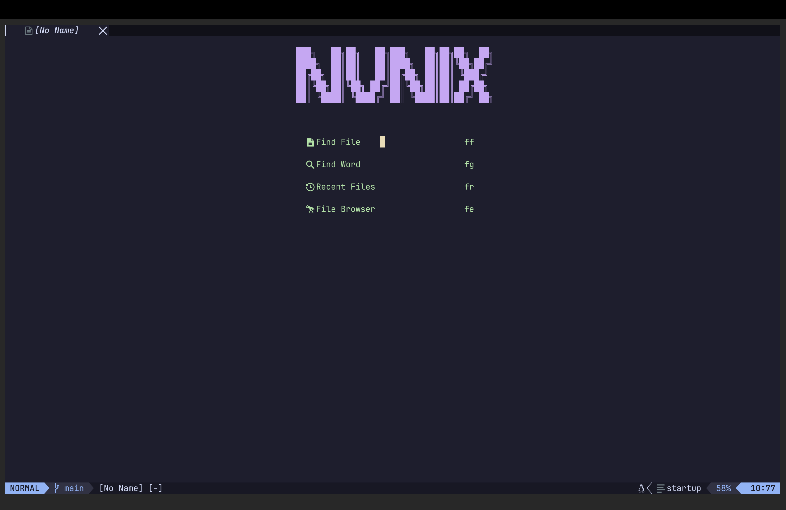
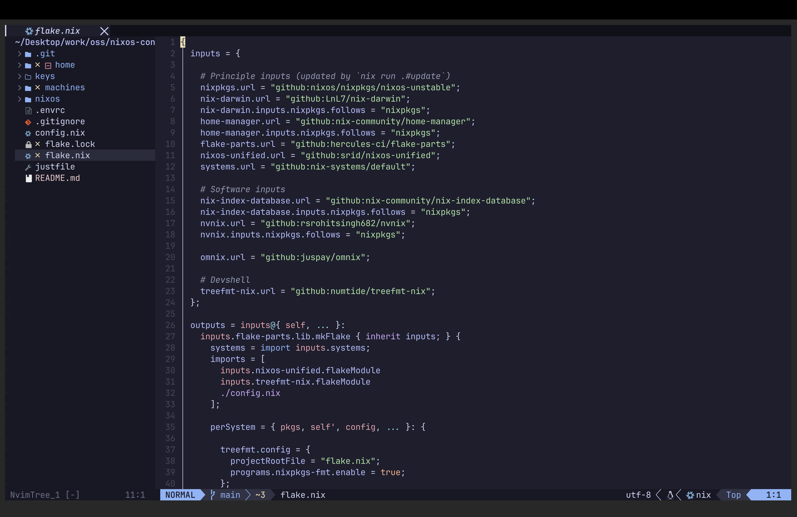

# nvnix
My Neovim Configuration in Nix




## Usage

You can try out this configuration without installing.

```sh
nix run --extra-experimental-features 'nix-command flakes' github:rsrohitsingh682/nvnix
```

### Installation

You can add this as a flake input.

```Nix
{
    inputs = {
        nvnix.url = "github:rsrohitsingh682/nvnix";
    };
}
```

Now you can either use [Home-Manager](https://github.com/nix-community/home-manager) or as a `NixOS Configuration` or even put it in devShell which will only be available inside a `Nix devShell`

#### Home-Manager:

```Nix
home-manager.users.<user>.home.packages = [
    inputs.nvnix.packages."${pkgs.system}".default
];
```

#### NixOS Configuration:

```Nix
environment.systemPackages = [
    inputs.nvnix.packages."${pkgs.system}".default
];
```

#### devShell:

```Nix
devShells.default = nixpkgs.mkShell {
    packages = [ inputs.nvnix.packages.${pkgs.system}.default ];
};
```

